<a href="https://www.linkedin.com/in/ilyas-daoud-el-asmi-0a531039b">
  
</a>

  
  
  

 

<picture>
  <source media="(prefers-color-scheme: dark)" srcset="assets/s01-dark.svg" />
  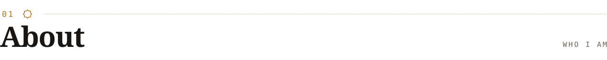
</picture>

I'm an **AI Engineer** working on **LLM fine-tuning, RAG and AI agents**, and I build full-stack AI products end to end, from the data and the model to the interface a real person uses: **OMNIA**, **AtlasKick AI**, a **Darija LLM** and **Real or Clone?**. I hold a Bachelor in Data Analytics & BI from EST Oujda.

- **AI.** At LEADZ Tech Services I fine-tuned a conversational LLM for **Moroccan Darija**, then built a **RAG pipeline with OCR** for intelligent document processing.
- **Machine learning.** At CHU Mohammed VI I built a **deep-learning model to help detect breast anomalies on mammograms**, from image preprocessing to evaluation.
- **Full-stack.** React 19, Next.js and TypeScript on the front. Django REST Framework or NestJS with Prisma and PostgreSQL behind it. Docker, Playwright, deployed.
- **WEBZI1 Studio.** My studio designs and ships multilingual (FR / EN / AR) websites for cafés, restaurants and shops in Morocco and Brussels.

I work in Arabic (native), French and English, and I ship interfaces in all three, right-to-left included.

 

<picture>
  <source media="(prefers-color-scheme: dark)" srcset="assets/s02-dark.svg" />
  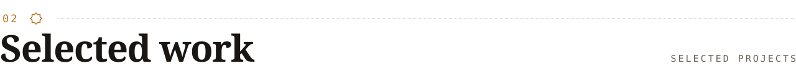
</picture>

<a href="https://github.com/ilyasdaoudrma/real-or-clone">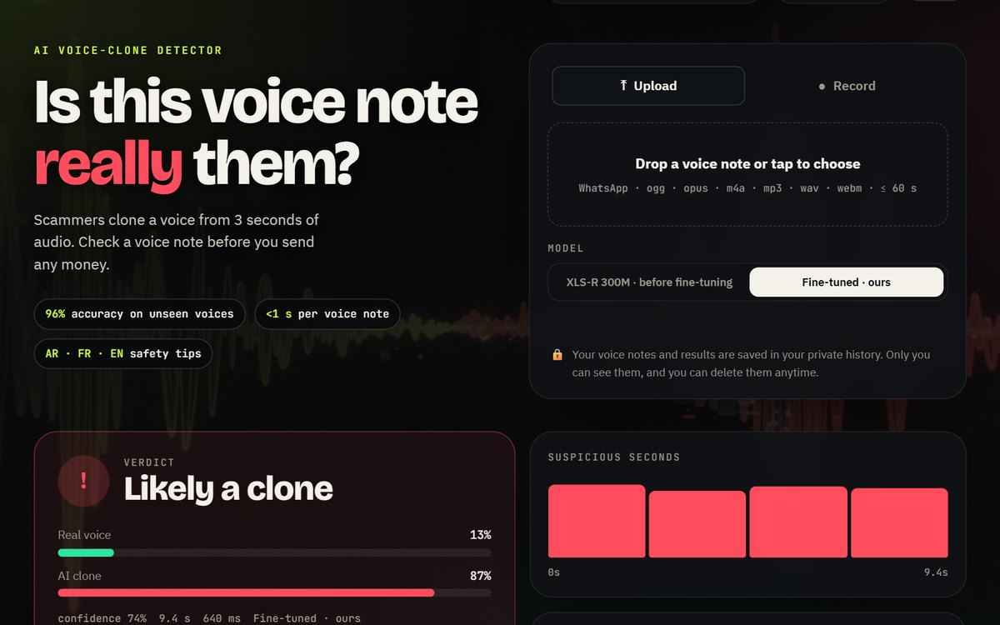</a>

### Real or Clone? &nbsp;·&nbsp; catching AI voice-clone scams in WhatsApp voice notes

Scammers need 3 seconds of audio to clone a voice and send a fake *"Mom, I had an accident, send money"* note. I **fine-tuned Meta's XLS-R 300M** on ~50,000 English and French clips turned into WhatsApp-style voice notes, including **1,619 fresh voice clones** I generated on an **NVIDIA L40S**. On held-out data it reaches **96.1% accuracy** and a **2.4% EER on cloning engines it never saw** (ElevenLabs, OpenAI, Gemini). My own tests caught a shortcut in the first model (it flagged 96% of real voices) and I fixed it, bringing false alarms down to ~7%. The app gives a verdict, the suspicious seconds and safety tips in Arabic, French or English, with Clerk login and a private history. Built in one day at the **GOMYCODE × NVIDIA** hackathon.

`PyTorch` `XLS-R 300M` `Chatterbox` `NVIDIA Brev` `FastAPI` `Clerk` `Groq`
&nbsp;→&nbsp; **[Code & results](https://github.com/ilyasdaoudrma/real-or-clone)** &nbsp;·&nbsp; **[90-s video](https://github.com/ilyasdaoudrma/real-or-clone/raw/main/web/demo.mp4)**

 

<a href="https://atlaskick-ai.vercel.app">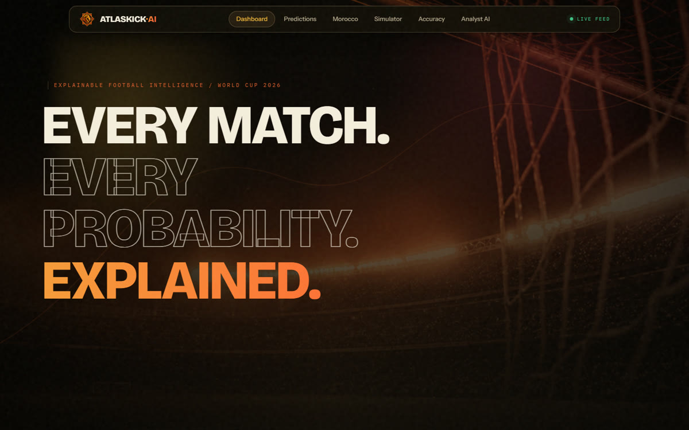</a>

### AtlasKick AI &nbsp;·&nbsp; explainable World Cup 2026 match intelligence

Not "my AI predicts the winner." Every probability breaks down into named, quantified factors: an **Elo + Poisson + ML ensemble** with **SHAP explanations**, a **10,000-run Monte Carlo** tournament simulator, and a grounded AI analyst. It also has a dedicated Morocco mode. Runs entirely in the browser with no backend.

`React 19` `TypeScript` `Vite` `Tailwind v4` `Framer Motion` `Groq · Llama 3.3`
&nbsp;→&nbsp; **[Live](https://atlaskick-ai.vercel.app)** &nbsp;·&nbsp; **[Code](https://github.com/ilyasdaoudrma/atlaskick-ai)**

 

<table>
  <tr>
    <td width="50%" valign="top">
      <a href="https://omnia-vert.vercel.app">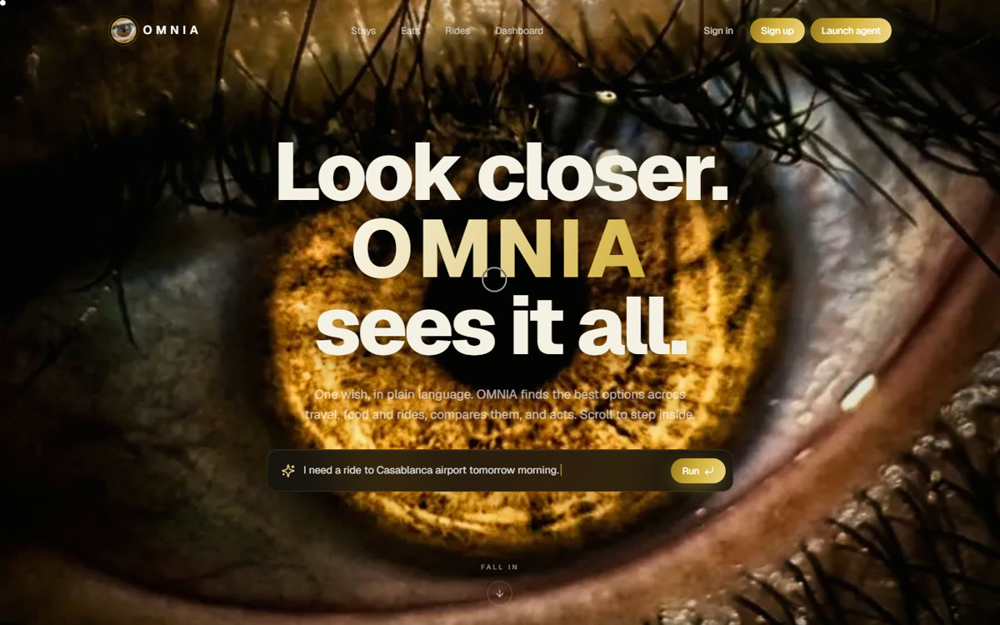</a>
      <h3>OMNIA</h3>
      
An agentic AI concierge you talk to in plain language. It plans and books across <b>stays, food and rides</b> in Morocco. It's <b>four full-stack apps sharing one Clerk login</b>: typed React frontends on NestJS + Prisma APIs over Neon Postgres, with rate limiting, server-to-server auth and a Playwright E2E suite.

      
<code>React 19</code> <code>NestJS</code> <code>Prisma</code> <code>PostgreSQL</code> <code>Groq</code>

      
→ <b><a href="https://omnia-vert.vercel.app">Live</a></b> · <b><a href="https://github.com/ilyasdaoudrma/omnia">Code</a></b>

    </td>
    <td width="50%" valign="top">
      <a href="https://ascend-ai-chi.vercel.app">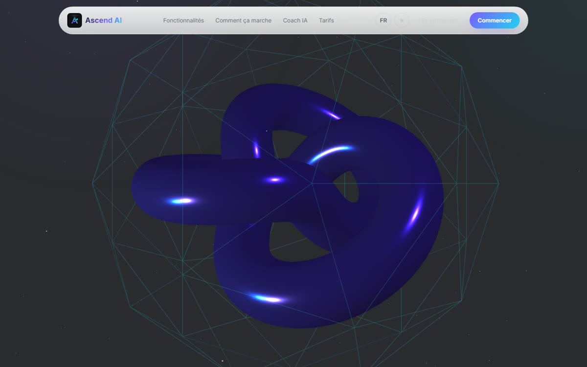</a>
      <h3>Ascend AI</h3>
      
A fitness tracker and social network for athletes, built end to end. I designed the relational schema, a <b>Django REST Framework</b> API with SimpleJWT, filtering, pagination and OpenAPI docs, and a <b>React 19</b> app on TanStack Query for workouts, analytics, feed and follows. The whole stack runs under Docker Compose.

      
<code>Django</code> <code>DRF</code> <code>PostgreSQL</code> <code>React 19</code> <code>Docker</code>

      
→ <b><a href="https://ascend-ai-chi.vercel.app">Live</a></b> · <b><a href="https://github.com/ilyasdaoudrma/ascend-ai">Code</a></b>

    </td>
  </tr>
</table>

#### Client work from WEBZI1 Studio

<table>
  <tr>
    <td width="50%" valign="top">
      <a href="https://kami-coffee.vercel.app">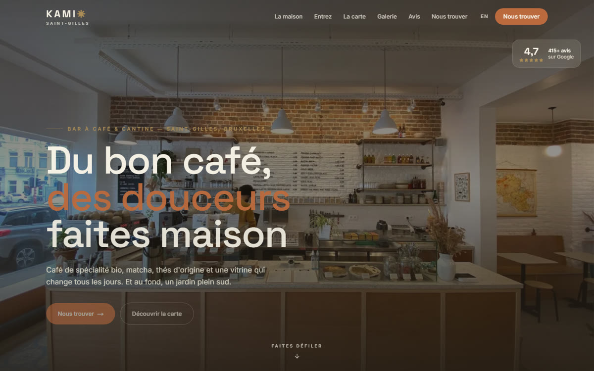</a>
      
<b>Kami</b>, a specialty coffee bar in Saint-Gilles, Brussels. Bilingual Next.js site with a full menu, reviews, a scroll-through "walk inside" and complete local SEO.

      
→ <b><a href="https://kami-coffee.vercel.app">kami-coffee.vercel.app</a></b>

    </td>
    <td width="50%" valign="top">
      <a href="https://mito-brugmann.vercel.app">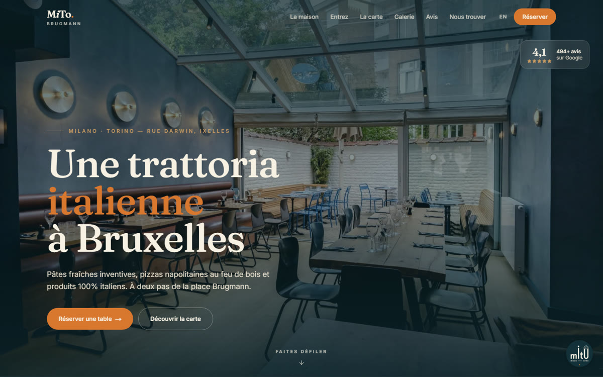</a>
      
<b>MiTo Brugmann</b>, an Italian trattoria in Ixelles, Brussels. Bilingual FR/EN rebuild with reservations, a priced menu, motion and structured data.

      
→ <b><a href="https://mito-brugmann.vercel.app">mito-brugmann.vercel.app</a></b> · <a href="https://github.com/ilyasdaoudrma/mito-brugmann">Code</a>

    </td>
  </tr>
</table>

<b>More from the lab</b>: private research, data work and smaller builds

 

| Project | What it is | Stack |
|---|---|---|
| **Gold Agent System** *(private)* | A simulation-only, multi-agent research platform for XAUUSD. Data, features, strategies, an LLM macro arbiter, sizing, risk, and backtest / walk-forward / stress testing. The honest result so far: technical-only strategies showed **no durable edge** on M15, H1 or H4, so it stays simulated while I add fundamental data. | Python · LLMs |
| **Instagram Engagement Analytics** | An ETL pipeline into a data warehouse, Random Forest classification and KMeans segmentation, feeding KPI dashboards. | Python · scikit-learn · Power BI |
| **Mammography anomaly detection** | Hospital internship project: deep-learning assistance for breast-anomaly detection, covering preprocessing and model evaluation. | Python · deep learning |
| **[Sunglasses S2L](https://sunglasses-s2l.vercel.app)** | An eyewear storefront concept with 3D product visuals. | Vite · Three.js |
| **[Dynamo Fit](https://dynamofit.vercel.app)** | A landing page for a gym in Salé, Morocco. | HTML · CSS · JS |

 

 

<picture>
  <source media="(prefers-color-scheme: dark)" srcset="assets/s03-dark.svg" />
  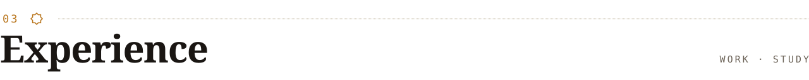
</picture>

<picture>
  <source media="(prefers-color-scheme: dark)" srcset="assets/timeline-dark.svg" />
  
</picture>

 

<picture>
  <source media="(prefers-color-scheme: dark)" srcset="assets/s04-dark.svg" />
  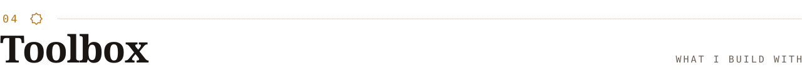
</picture>

  
   
  

| | |
|---|---|
| **AI & data** | LLM fine-tuning · RAG · OCR · deep learning · scikit-learn · pandas · NumPy · ETL · data warehousing · Power BI |
| **Backend** | Django REST Framework · SimpleJWT · NestJS · Prisma · REST & OpenAPI · PostgreSQL / Neon · Supabase |
| **Frontend** | React 19 · Next.js App Router · TypeScript · TanStack Query · Zustand · Framer Motion · GSAP · Three.js |
| **Shipping** | Git & PR workflow · Docker Compose · Playwright E2E · Vercel · SEO & structured data · i18n with RTL |

 

<picture>
  <source media="(prefers-color-scheme: dark)" srcset="assets/s05-dark.svg" />
  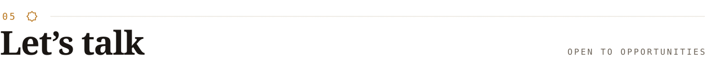
</picture>

I'm open to **AI, data and full-stack roles**, and to building a website for your business. The fastest way to reach me is **[LinkedIn](https://www.linkedin.com/in/ilyas-daoud-el-asmi-0a531039b)** or **[idaoud361@gmail.com](mailto:idaoud361@gmail.com)**.

